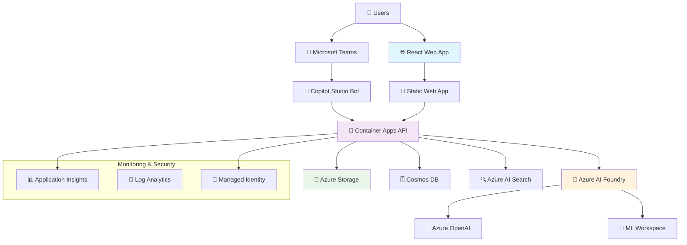
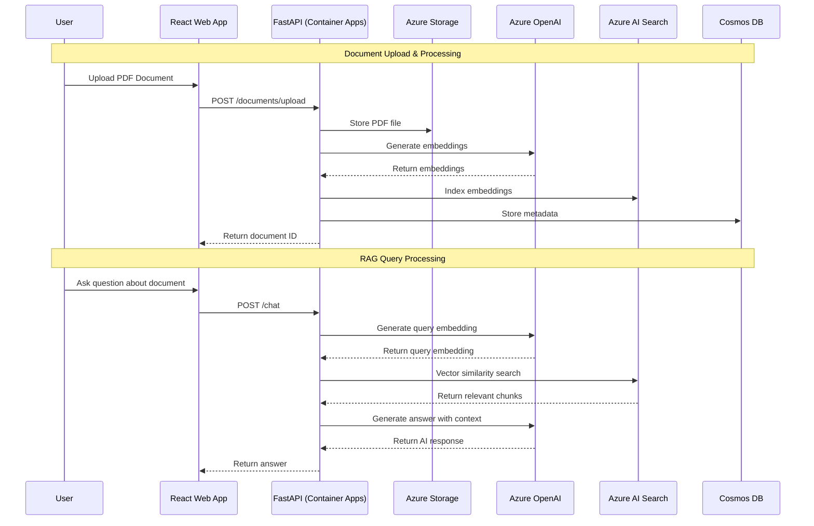

# DocGenAI - Enterprise RAG Solution 🚀

<div align="center">


**Deploy a complete PDF document analysis solution with Azure AI Foundry + RAG capabilities in just one command!**

[🚀 Quick Start](#-quick-start) • [🏗️ Architecture](#️-architecture) • [📋 Features](#-features) • [🔧 Development](#-development)

</div>

---

## 🎯 What is DocGenAI?

DocGenAI is an **enterprise-grade Retrieval Augmented Generation (RAG)** solution that transforms how organizations interact with their PDF documents. Upload any PDF document and ask intelligent questions about its content using natural language.

### ✨ Key Highlights
- 🤖 **AI-Powered**: Azure OpenAI GPT-4o-mini for intelligent responses
- 📄 **PDF Analysis**: Advanced document processing and chunking
- 🔍 **Vector Search**: Semantic search with Azure AI Search
- 🌐 **Modern UI**: React TypeScript with Fluent UI components
- ⚡ **One-Command Deploy**: From zero to production in 10 minutes
- 🔐 **Enterprise Security**: Azure Managed Identity and RBAC

---

## 🚀 Quick Start

### Option 1: Windows PowerShell (Recommended)
```powershell
git clone https://github.com/gitpavleenbali/DocGenAI.git
cd DocGenAI
.\deploy.ps1
```

### Option 2: Mac/Linux Bash
```bash
git clone https://github.com/gitpavleenbali/DocGenAI.git
cd DocGenAI
chmod +x deploy.sh
./deploy.sh
```

### ⏱️ Deployment Timeline
```
⏳ Prerequisites Check     (1-2 minutes)
🔐 Azure Authentication   (1 minute)  
🏗️ Infrastructure Setup   (5-8 minutes)
🚀 Application Deployment (2-3 minutes)
✅ Ready to Use!          (Total: ~10 minutes)
```

---

## 🏗️ Architecture

### System Overview



### RAG Data Flow



### Technology Stack

<div align="center">

| Layer | Technology | Purpose |
|-------|------------|---------|
| **Frontend** | React 18 + TypeScript | Modern web interface |
| **Backend** | FastAPI + Python 3.9 | RAG processing engine |
| **AI Models** | GPT-4o-mini + text-embedding-3-small | Chat + embeddings |
| **Vector Store** | Azure AI Search | Semantic search |
| **Document Store** | Azure Blob Storage | PDF file storage |
| **Metadata** | Cosmos DB | Document metadata |
| **Hosting** | Azure Container Apps | Auto-scaling hosting |
| **Monitoring** | Application Insights | Performance tracking |

</div>

---

## 📋 Features

### 🤖 AI Capabilities
- **Intelligent Q&A**: Ask questions about your documents in natural language
- **Context-Aware**: Responses include relevant document excerpts
- **Multi-Document**: Query across multiple uploaded documents
- **Semantic Search**: Find content based on meaning, not just keywords

### 📄 Document Processing
- **PDF Support**: Upload and process PDF documents
- **Smart Chunking**: Intelligent text segmentation for optimal retrieval
- **Metadata Extraction**: Automatic extraction of document properties
- **Vector Embeddings**: High-quality text embeddings for search

### 🌐 User Experience
- **Drag & Drop Upload**: Intuitive document upload interface
- **Real-Time Chat**: Instant responses with typing indicators
- **Document Management**: View and manage uploaded documents
- **Responsive Design**: Works on desktop, tablet, and mobile

### 🔐 Enterprise Features
- **Azure AD Integration**: Enterprise authentication
- **Managed Identity**: Secure service-to-service communication
- **RBAC**: Role-based access control
- **Audit Logging**: Comprehensive activity tracking
- **Data Residency**: Configure deployment region for compliance

---

## 💰 Cost Structure

### Development Environment
```
📊 Estimated Monthly Costs:
┌─────────────────────────┬──────────────┐
│ Service                 │ Monthly Cost │
├─────────────────────────┼──────────────┤
│ Container Apps          │ ~$15         │
│ Azure OpenAI            │ ~$20-50      │
│ Azure AI Search (Basic) │ ~$250        │
│ Cosmos DB (Serverless)  │ ~$5-15       │
│ Blob Storage            │ ~$5          │
│ Application Insights    │ ~$5          │
├─────────────────────────┼──────────────┤
│ TOTAL                   │ ~$300-340    │
└─────────────────────────┴──────────────┘

💡 Scales with usage - pay only for what you use
```

### Cost Optimization Tips
- **AI Search**: Largest cost component - consider Basic tier for development
- **OpenAI**: Token-based pricing - optimize prompts and responses
- **Cosmos DB**: Serverless model scales to zero when not in use

---

## 🧪 Testing Your Deployment

After successful deployment, test the system:

### 1. Upload Test Document
Use the included `test-document.txt` file or upload your own PDF.

### 2. Try Sample Questions
```
❓ "What Azure services are used in DocGenAI?"
❓ "How does the RAG pipeline work?"
❓ "What are the main features of this solution?"
❓ "What is the estimated cost for running this system?"
```

### 3. Verify Components
- ✅ Document upload works
- ✅ AI responses are relevant
- ✅ Vector search returns accurate results
- ✅ All Azure services are running

---

## 🔧 Development

### Prerequisites
- **Azure Subscription** with contributor access
- **Docker Desktop** - [Download here](https://www.docker.com/products/docker-desktop)
- **Git** (automatically installed by script)

### Local Development

#### Backend Development
```bash
cd api
python -m venv venv
source venv/bin/activate  # On Windows: venv\Scripts\activate
pip install -r requirements.txt
uvicorn main:app --reload --port 8000
```

#### Frontend Development
```bash
cd webapp
npm install
npm start
```

### Project Structure
```
DocGenAI/
├── 📁 infra/              # Bicep infrastructure templates
│   ├── main.bicep         # Main deployment template
│   └── modules/           # Service-specific modules
├── 📁 api/                # FastAPI backend
│   ├── main.py           # Application entry point
│   ├── routers/          # API route handlers
│   └── services/         # Business logic
├── 📁 webapp/             # React frontend
│   ├── src/              # Source code
│   ├── public/           # Static assets
│   └── package.json      # Dependencies
├── 📁 scripts/            # Deployment utilities
├── 📁 docs/               # Additional documentation
├── deploy.ps1             # Windows deployment script
├── deploy.sh              # Linux/Mac deployment script
└── azure.yaml            # Azure Developer CLI config
```

### Advanced Configuration

#### Custom Environment Name
```powershell
.\deploy.ps1 -EnvironmentName "my-production-env"
```

#### Skip Prerequisites Check
```powershell
.\deploy.ps1 -SkipPrerequisites
```

#### Environment Variables
The system automatically configures these environment variables:
- `AZURE_OPENAI_ENDPOINT`
- `AZURE_OPENAI_KEY`
- `AZURE_SEARCH_ENDPOINT`
- `AZURE_SEARCH_KEY`
- `AZURE_STORAGE_ACCOUNT`
- `COSMOS_DB_ENDPOINT`

---

## 🚨 Troubleshooting

### Common Issues

<details>
<summary><strong>"Azure CLI not found"</strong></summary>

```powershell
# Install Azure CLI
winget install Microsoft.AzureCLI
# Restart your terminal
```
</details>

<details>
<summary><strong>"azd command not found"</strong></summary>

```powershell
# Install Azure Developer CLI
winget install Microsoft.Azd
# Restart your terminal
```
</details>

<details>
<summary><strong>"Docker not running"</strong></summary>

- Start Docker Desktop
- Ensure Docker daemon is running
- Check if containers can be created: `docker run hello-world`
</details>

<details>
<summary><strong>"Deployment failed"</strong></summary>

```powershell
# Check detailed logs
azd show
az group list
azd logs

# Common fixes:
# 1. Ensure you have Contributor role on subscription
# 2. Check if resource names are unique
# 3. Verify quota limits for chosen region
```
</details>

### Resource Cleanup
```powershell
# Remove all deployed resources
azd down --purge
```

### Get Help
1. Check the troubleshooting section above
2. Review deployment logs: `azd logs`
3. Check Azure Portal for resource status
4. Create a GitHub issue with logs attached

---

## 📊 Monitoring & Observability

### Application Insights Dashboard
- **Performance Metrics**: Response times, throughput
- **Error Tracking**: Exceptions and failed requests
- **User Analytics**: Usage patterns and behavior
- **Dependency Tracking**: External service calls

### Health Endpoints
- **API Health**: `GET /health`
- **Database Connectivity**: `GET /health/db`
- **AI Services Status**: `GET /health/ai`

---

## 🤝 Contributing

We welcome contributions! Here's how to get started:

1. **Fork** the repository
2. **Create** a feature branch: `git checkout -b feature/amazing-feature`
3. **Test** your changes with the deployment script
4. **Commit** your changes: `git commit -m 'Add amazing feature'`
5. **Push** to the branch: `git push origin feature/amazing-feature`
6. **Open** a Pull Request

### Development Guidelines
- Follow existing code style and conventions
- Add tests for new features
- Update documentation as needed
- Ensure deployment script still works

---

## 📜 License

This project is licensed under the MIT License - see the [LICENSE](LICENSE) file for details.

---

## 🎉 What You Get After Deployment

<div align="center">

### 🌐 **Web Application**
*Modern React interface for document upload and chat*

### 🔌 **API Endpoints**
*RESTful backend with OpenAPI documentation*

### 📊 **Azure Dashboard**
*Complete monitoring and management portal*

### 📈 **Scalable Infrastructure**
*Auto-scaling based on demand*

</div>

---

<div align="center">

**Ready to transform your document workflow?**

[🚀 **Start Now**](#-quick-start) | [📖 **Learn More**](docs/) | [💬 **Get Support**](https://github.com/gitpavleenbali/DocGenAI/issues)

**Happy Document Chatting! 🤖📄**

</div>
