# Reference Architecture

## 🏗️ System Architecture Overview

### High-Level Architecture


### Data Flow Architecture


## 🧩 Component Details

### Frontend Layer

#### React Web Application
- **Technology**: React 18 + TypeScript
- **UI Framework**: Azure Fluent UI
- **Hosting**: Azure Static Web Apps
- **Features**:
  - Document upload with drag & drop
  - Real-time chat interface
  - Document management
  - Responsive design

#### Microsoft Teams Integration
- **Technology**: Copilot Studio
- **Features**:
  - Natural language processing
  - Multi-turn conversations
  - Teams channel integration
  - User context awareness

### API Layer

#### FastAPI Backend
- **Technology**: Python 3.9 + FastAPI
- **Hosting**: Azure Container Apps
- **Features**:
  - RESTful API endpoints
  - Async request processing
  - Health monitoring
  - Auto-scaling

**Key Endpoints**:
```
POST /documents/upload     # Upload and process documents
GET  /documents           # List user documents
POST /chat               # Chat with documents
GET  /health             # Health check
```

### AI & Data Layer

#### Azure AI Foundry
- **Components**:
  - AI Hub workspace
  - AI Project
  - Model deployments
- **Models**:
  - `gpt-4o-mini`: Chat completions
  - `text-embedding-3-small`: Embeddings

#### Azure Storage
- **Type**: Blob Storage (Standard LRS)
- **Containers**:
  - `documents`: PDF files
  - `embeddings`: Processed chunks
  - `logs`: Application logs

#### Cosmos DB
- **API**: SQL (Core)
- **Consistency**: Session
- **Containers**:
  - `documents`: Document metadata
  - `conversations`: Chat history
  - `sessions`: User sessions
  - `vectors`: Embedding vectors

#### Azure AI Search
- **Tier**: Basic
- **Features**:
  - Vector search
  - Semantic search
  - Full-text search
- **Indexes**:
  - `documents-index`: Main document index
  - `embeddings-index`: Vector embeddings

### Infrastructure Layer

#### Container Apps Environment
- **Features**:
  - Auto-scaling (1-10 replicas)
  - HTTPS ingress
  - Custom domain support
  - Log integration

#### Monitoring & Logging
- **Application Insights**: Application performance monitoring
- **Log Analytics**: Centralized logging
- **Azure Monitor**: Infrastructure monitoring

#### Security
- **Managed Identity**: Service-to-service authentication
- **RBAC**: Role-based access control
- **Key Vault**: Secrets management (optional)

## 🔧 Configuration Details

### Environment Variables
```yaml
# AI Configuration
AZURE_OPENAI_ENDPOINT: https://your-openai.openai.azure.com/
AZURE_OPENAI_API_VERSION: 2024-02-15-preview
AZURE_OPENAI_CHAT_DEPLOYMENT: gpt-4o-mini
AZURE_OPENAI_EMBEDDING_DEPLOYMENT: text-embedding-3-small

# Storage Configuration
AZURE_STORAGE_ACCOUNT_NAME: your-storage-account
AZURE_STORAGE_CONTAINER_NAME: documents

# Database Configuration
AZURE_COSMOS_ENDPOINT: https://your-cosmos.documents.azure.com:443/
AZURE_COSMOS_DATABASE_NAME: docgen

# Search Configuration
AZURE_SEARCH_ENDPOINT: https://your-search.search.windows.net
AZURE_SEARCH_INDEX_NAME: documents-index
```

### Resource Naming Convention
```
Resource Type        | Naming Pattern              | Example
-------------------- | --------------------------- | ---------------------------
Resource Group       | rg-{env-name}              | rg-docgenai-dev
Storage Account      | st{env-name}{token}        | stdocgenaidev12345
Cosmos DB            | cosmos-{env-name}-{token}  | cosmos-docgenai-dev-12345
AI Search            | srch-{env-name}-{token}    | srch-docgenai-dev-12345
Container App        | ca-api-{env-name}-{token}  | ca-api-docgenai-dev-12345
OpenAI Service       | cs-openai-{token}          | cs-openai-12345
```

## 📊 Scalability & Performance

### Auto-scaling Configuration
```yaml
Container Apps:
  Min Replicas: 1
  Max Replicas: 10
  Scale Rules:
    - HTTP Requests: 10 concurrent requests per replica
    - CPU: 70% threshold
    - Memory: 80% threshold
```

### Performance Characteristics
- **API Response Time**: < 500ms (excluding AI processing)
- **Document Processing**: 2-5 seconds per page
- **Chat Response**: 1-3 seconds
- **Concurrent Users**: 100+ (with auto-scaling)

### Cost Optimization
- **Container Apps**: Pay-per-use with auto-scaling
- **Cosmos DB**: Serverless billing
- **OpenAI**: Token-based pricing
- **Storage**: Hot tier for active documents

## 🔒 Security Architecture

### Authentication & Authorization

```mermaid
graph LR
    User[👤 User] --> WebApp[🌐 Web App]
    User --> Teams[💬 Teams]
    
    WebApp --> API[🐳 API]
    Teams --> CopilotStudio[🤖 Bot]
    CopilotStudio --> API
    
    API --> MI[🔐 Managed Identity]
    MI --> OpenAI[🤖 OpenAI]
    MI --> Storage[💾 Storage]
    MI --> Cosmos[🗄️ Cosmos]
    MI --> Search[🔍 Search]
```


### Network Security
- **Private Endpoints**: Optional for enhanced security
- **HTTPS Only**: All communications encrypted
- **CORS**: Configured for web app domain
- **Firewall Rules**: Restrict access by IP (optional)

### Data Protection
- **Encryption at Rest**: All Azure services
- **Encryption in Transit**: TLS 1.2+
- **Data Residency**: Configurable by region
- **Backup**: Automated for Cosmos DB

## 🚀 Deployment Architecture

### CI/CD Pipeline

```mermaid
graph LR
    Code[📝 Source Code] --> Build[🔨 Build]
    Build --> Test[🧪 Test]
    Test --> Deploy[🚀 Deploy]
    
    Deploy --> Infra[🏗️ Infrastructure]
    Deploy --> App[📱 Applications]
    
    Infra --> Azure[☁️ Azure Resources]
    App --> ContainerApps[🐳 Container Apps]
    App --> StaticWebApps[📱 Static Web Apps]
```


### Infrastructure as Code
- **Tool**: Azure Bicep
- **Modules**: Separated by service
- **Parameters**: Environment-specific configuration
- **Outputs**: Resource references and connection strings

### Application Deployment
- **API**: Container image to Azure Container Registry
- **Web App**: Static files to Azure Static Web Apps
- **Bot**: Configuration to Copilot Studio

---

This architecture provides a scalable, secure, and maintainable foundation for enterprise document AI solutions.
