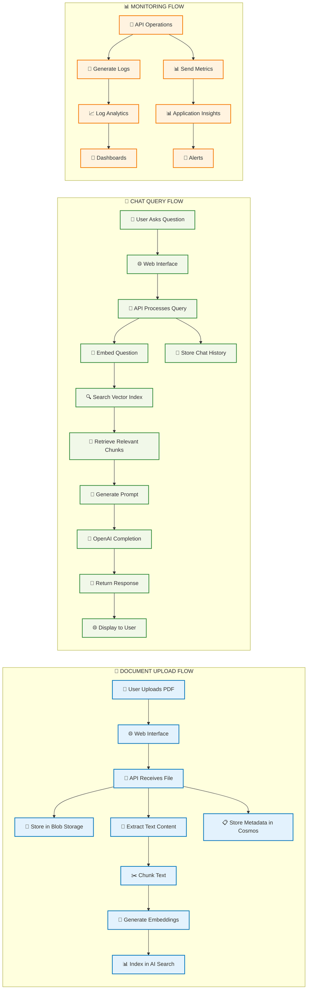
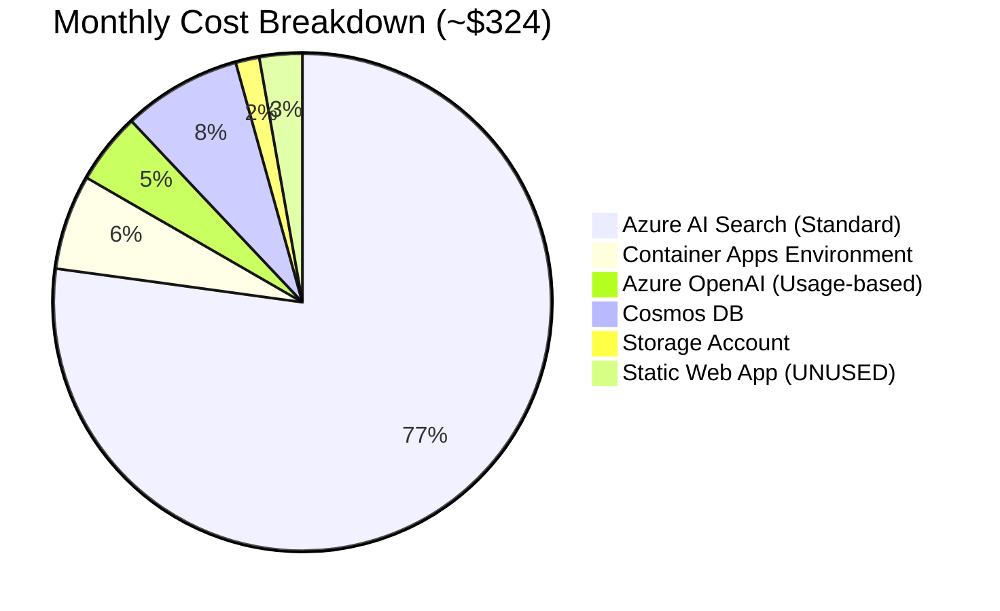
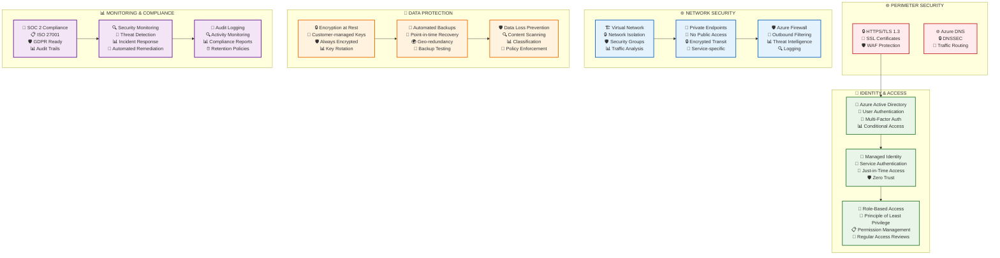
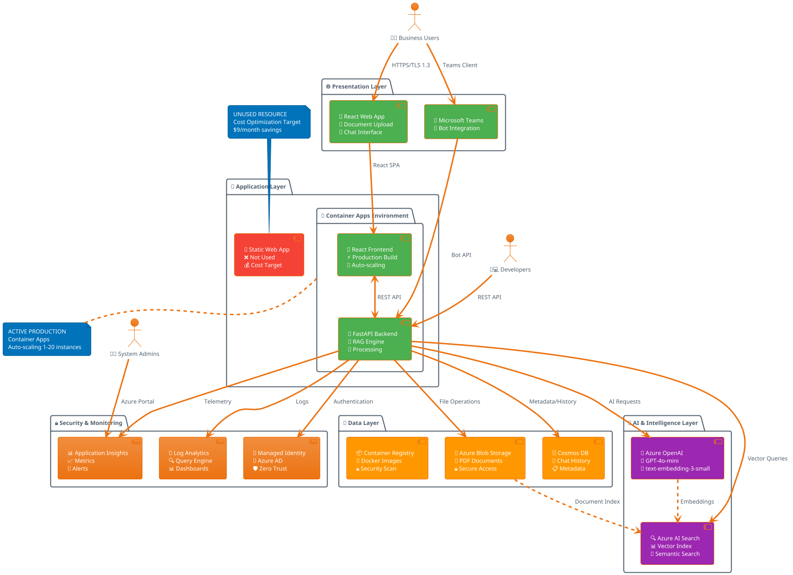

# DocGenAI - Visual Architecture Diagrams

## 🎨 Complete Visual Architecture (Mermaid Format)

### 1. System Architecture Overview (Visually Rich)

```mermaid
graph TB
    %% User Layer
    subgraph "👥 USER LAYER"
        Users[👨‍💼 Business Users<br/>📱 Mobile & Desktop]
        Devs[👨‍💻 Developers<br/>🔧 API Integration]
        Admins[👨‍🔧 System Admins<br/>📊 Monitoring]
    end
    
    %% Presentation Layer
    subgraph "🌐 PRESENTATION LAYER"
        WebApp[🎨 React Web Application<br/>📄 Document Upload<br/>💬 Chat Interface<br/>📊 Analytics Dashboard]
        Teams[💬 Microsoft Teams<br/>🤖 Bot Integration<br/>📢 Notifications]
    end
    
    %% Bot Layer
    subgraph "🤖 BOT INTEGRATION"
        CopilotStudio[🎯 Microsoft Copilot Studio<br/>🔄 Workflow Automation<br/>📝 Conversation Flows<br/>🔗 Teams Integration]
    end
    
    %% Application Layer
    subgraph "🚀 APPLICATION LAYER"
        ContainerEnv[🐳 Container Apps Environment<br/>⚡ Auto-scaling<br/>🔄 Load Balancing]
        
        subgraph "Active Services"
            WebContainer[📱 React Frontend Container<br/>🎨 Fluent UI Components<br/>⚡ Real-time Updates]
            APIContainer[🔧 FastAPI Backend Container<br/>🧠 RAG Engine<br/>📄 Document Processing<br/>🔍 Vector Search]
        end
        
        subgraph "Unused Resources"
            StaticWebApp[📱 Static Web App<br/>❌ Not Used<br/>💰 Cost Optimization Target]
        end
    end
    
    %% AI & Data Layer
    subgraph "🧠 AI & INTELLIGENCE LAYER"
        AIFoundry[🏭 Azure AI Foundry<br/>🔬 Model Management<br/>📊 Prompt Engineering<br/>🎯 Content Safety]
        
        OpenAI[🤖 Azure OpenAI Service<br/>💬 GPT-4o-mini Chat<br/>🔢 text-embedding-3-small<br/>⚡ Real-time Processing]
        
        AISearch[🔍 Azure AI Search<br/>📊 Vector Index (1536-dim)<br/>🎯 Semantic Search<br/>📈 Relevance Scoring]
    end
    
    %% Data Layer
    subgraph "💾 DATA LAYER"
        Storage[📁 Azure Blob Storage<br/>📄 PDF Documents<br/>🔒 Secure Access<br/>📊 Metadata]
        
        CosmosDB[🗄️ Cosmos DB<br/>👤 User Sessions<br/>💬 Chat History<br/>📋 Document Metadata<br/>🔄 Global Distribution]
        
        Registry[📦 Container Registry<br/>🐳 Docker Images<br/>🔄 Version Control<br/>🔒 Security Scanning]
    end
    
    %% Security & Monitoring
    subgraph "🔒 SECURITY & MONITORING"
        Identity[🔐 Managed Identity<br/>🎫 Azure AD Integration<br/>🛡️ Zero Trust<br/>🔑 RBAC]
        
        Monitoring[📊 Application Insights<br/>📈 Performance Metrics<br/>🚨 Error Tracking<br/>📱 Real-time Alerts]
        
        Logging[📝 Log Analytics<br/>🔍 Query Engine<br/>📊 Custom Dashboards<br/>📈 Usage Analytics]
    end
    
    %% Infrastructure
    subgraph "🏗️ INFRASTRUCTURE"
        ResourceGroup[📁 Resource Group<br/>🏷️ Tagged Resources<br/>💰 Cost Management<br/>🔒 Access Control]
        
        Networking[🌐 Virtual Network<br/>🔒 Private Endpoints<br/>🛡️ Network Security<br/>⚡ CDN Integration]
    end
    
    %% Connections with rich styling
    Users -.->|HTTPS/TLS 1.3| WebApp
    Users -.->|Teams Client| Teams
    Devs -.->|REST API| APIContainer
    Admins -.->|Azure Portal| Monitoring
    
    WebApp -->|React SPA| WebContainer
    Teams -->|Bot Framework| CopilotStudio
    CopilotStudio -->|API Calls| APIContainer
    WebContainer <-->|REST API| APIContainer
    
    APIContainer -->|AI Requests| OpenAI
    APIContainer -->|Vector Queries| AISearch
    APIContainer -->|File Storage| Storage
    APIContainer -->|Metadata| CosmosDB
    
    OpenAI -.->|Model Management| AIFoundry
    AISearch -->|Index Storage| Storage
    
    APIContainer -->|Authentication| Identity
    APIContainer -->|Telemetry| Monitoring
    APIContainer -->|Logs| Logging
    
    %% Styling
    classDef userLayer fill:#e1f5fe,stroke:#01579b,stroke-width:2px
    classDef presentationLayer fill:#f3e5f5,stroke:#4a148c,stroke-width:2px
    classDef applicationLayer fill:#e8f5e8,stroke:#1b5e20,stroke-width:2px
    classDef aiLayer fill:#fff3e0,stroke:#e65100,stroke-width:2px
    classDef dataLayer fill:#fce4ec,stroke:#880e4f,stroke-width:2px
    classDef securityLayer fill:#f1f8e9,stroke:#33691e,stroke-width:2px
    classDef infrastructureLayer fill:#ede7f6,stroke:#311b92,stroke-width:2px
    classDef unused fill:#ffebee,stroke:#c62828,stroke-width:2px,stroke-dasharray: 5 5
    
    class Users,Devs,Admins userLayer
    class WebApp,Teams presentationLayer
    class ContainerEnv,WebContainer,APIContainer applicationLayer
    class StaticWebApp unused
    class AIFoundry,OpenAI,AISearch aiLayer
    class Storage,CosmosDB,Registry dataLayer
    class Identity,Monitoring,Logging securityLayer
    class ResourceGroup,Networking infrastructureLayer
```

### 2. Data Flow Architecture (Process View)



### 3. Deployment Architecture (Infrastructure View)

```mermaid
graph TB
    %% Development Environment
    subgraph "💻 DEVELOPMENT"
        Dev[👨‍💻 Developer Workstation<br/>🔧 VS Code + Extensions<br/>🐳 Docker Desktop<br/>☁️ Azure CLI]
        Git[📚 Git Repository<br/>📝 Source Code<br/>🏗️ Infrastructure as Code<br/>📋 Documentation]
    end
    
    %% CI/CD Pipeline
    subgraph "🚀 DEPLOYMENT PIPELINE"
        Script[📜 deploy.ps1/deploy.sh<br/>✅ Prerequisites Check<br/>🔐 Azure Authentication<br/>⚡ One-Command Deploy]
        AZD[🛠️ Azure Developer CLI<br/>🏗️ Infrastructure Provisioning<br/>📦 Application Deployment<br/>🔄 Environment Management]
    end
    
    %% Azure Infrastructure
    subgraph "☁️ AZURE PRODUCTION"
        RG[📁 Resource Group (rg-dev)<br/>🏷️ Environment: Development<br/>📍 Location: East US 2<br/>💰 Cost Center: DocGenAI]
        
        subgraph "🐳 Container Platform"
            CAE[🏗️ Container Apps Environment<br/>🔄 Auto-scaling Configuration<br/>🌐 Ingress Management<br/>📊 Monitoring Integration]
            CA1[📱 Web App Container<br/>⚡ React Production Build<br/>🔄 Health Checks<br/>📈 Scaling Rules: 1-10 instances]
            CA2[🔧 API Container<br/>🐍 Python FastAPI<br/>🧠 RAG Engine<br/>📈 Scaling Rules: 1-20 instances]
        end
        
        subgraph "🧠 AI Services"
            AOI[🤖 Azure OpenAI<br/>🎯 Model: GPT-4o-mini<br/>🔢 Embeddings: text-embedding-3-small<br/>💰 Pricing: Pay-per-token]
            AIS[🔍 Azure AI Search<br/>📊 Standard Tier<br/>🔢 Vector Index: 1536 dimensions<br/>📈 Search Units: 1 (scalable)]
        end
        
        subgraph "💾 Data Services"
            BS[📁 Blob Storage (Hot Tier)<br/>📄 PDF Document Storage<br/>🔒 Private Access<br/>🔄 Redundancy: LRS]
            CDB[🗄️ Cosmos DB (NoSQL)<br/>📋 Document Metadata<br/>💬 Chat History<br/>🌍 Single Region (cost optimization)]
        end
        
        subgraph "📊 Observability"
            AI2[📊 Application Insights<br/>📈 Performance Monitoring<br/>🐛 Error Tracking<br/>👤 User Analytics]
            LA[📝 Log Analytics Workspace<br/>🔍 Centralized Logging<br/>📊 Custom Queries<br/>🚨 Alert Rules]
        end
        
        subgraph "🔒 Security"
            MI[🔐 Managed Identity<br/>🎫 Service Authentication<br/>🛡️ Zero Trust Architecture<br/>🔑 Role-Based Access]
            CR[📦 Container Registry<br/>🐳 Private Image Storage<br/>🔒 Security Scanning<br/>🏷️ Image Versioning]
        end
    end
    
    %% Customer Environment
    subgraph "🏢 CUSTOMER ENVIRONMENT"
        Cust[👥 Customer Infrastructure<br/>💻 PowerShell/Bash Terminal<br/>☁️ Azure Subscription<br/>🔐 Administrative Access]
        Result[✅ Deployed Solution<br/>🌐 Web Application URL<br/>🔌 API Endpoint<br/>📊 Monitoring Dashboard]
    end
    
    %% Flow connections
    Dev -->|git push| Git
    Git -->|clone/pull| Script
    Script -->|azd up| AZD
    AZD -->|provision & deploy| RG
    
    CAE --> CA1
    CAE --> CA2
    CA1 <-->|REST API| CA2
    CA2 --> AOI
    CA2 --> AIS
    CA2 --> BS
    CA2 --> CDB
    CA2 --> MI
    CA2 --> AI2
    AI2 --> LA
    
    Script -.->|10 minutes| Cust
    Cust -->|receives| Result
    
    %% Styling
    classDef devEnv fill:#e8f5e8,stroke:#2e7d32,stroke-width:2px
    classDef cicdEnv fill:#fff3e0,stroke:#f57c00,stroke-width:2px
    classDef azureInfra fill:#e3f2fd,stroke:#1976d2,stroke-width:2px
    classDef customerEnv fill:#f3e5f5,stroke:#7b1fa2,stroke-width:2px
    classDef containers fill:#e0f2f1,stroke:#00695c,stroke-width:2px
    classDef aiServices fill:#fce4ec,stroke:#c2185b,stroke-width:2px
    classDef dataServices fill:#f1f8e9,stroke:#558b2f,stroke-width:2px
    classDef observability fill:#fff8e1,stroke:#ff8f00,stroke-width:2px
    classDef security fill:#fafafa,stroke:#424242,stroke-width:2px
    
    class Dev,Git devEnv
    class Script,AZD cicdEnv
    class RG azureInfra
    class Cust,Result customerEnv
    class CAE,CA1,CA2 containers
    class AOI,AIS aiServices
    class BS,CDB dataServices
    class AI2,LA observability
    class MI,CR security
```

### 4. Cost Optimization View



### 5. Security Architecture (Zero Trust View)



## 🎨 Draw.io Compatible Formats

### 1. CSV Format for Draw.io Import

```csv
Name,Type,Parent,Note,Icon
DocGenAI System,Container,,Enterprise RAG Solution,🏗️
User Layer,Container,DocGenAI System,External Users,👥
Business Users,Actor,User Layer,End Users,👨‍💼
Developers,Actor,User Layer,API Consumers,👨‍💻
System Admins,Actor,User Layer,Operations,👨‍🔧
Presentation Layer,Container,DocGenAI System,User Interfaces,🌐
React Web App,Component,Presentation Layer,Main Interface,🎨
Microsoft Teams,Component,Presentation Layer,Bot Integration,💬
Application Layer,Container,DocGenAI System,Compute Services,🚀
Container Apps Env,Component,Application Layer,Hosting Platform,🐳
React Frontend,Component,Container Apps Env,UI Container,📱
FastAPI Backend,Component,Container Apps Env,API Container,🔧
Static Web App,Component,Application Layer,Unused Resource,❌
AI Layer,Container,DocGenAI System,Intelligence Services,🧠
Azure OpenAI,Component,AI Layer,GPT-4o-mini,🤖
Azure AI Search,Component,AI Layer,Vector Search,🔍
Data Layer,Container,DocGenAI System,Storage Services,💾
Blob Storage,Component,Data Layer,Document Storage,📁
Cosmos DB,Component,Data Layer,Metadata Storage,🗄️
Security Layer,Container,DocGenAI System,Security Services,🔒
Managed Identity,Component,Security Layer,Authentication,🔐
Application Insights,Component,Security Layer,Monitoring,📊
```

### 2. PlantUML Format (Can be rendered as images)



### 3. Lucidchart/Visio Compatible XML Schema

```xml
<shapes>
    <shape id="users" type="actor" x="50" y="50" width="100" height="60" 
           label="👥 Users" color="#E3F2FD" />
    <shape id="webapp" type="component" x="200" y="50" width="150" height="80" 
           label="🌐 React Web App\n📄 Upload\n💬 Chat" color="#4CAF50" />
    <shape id="api" type="component" x="200" y="200" width="150" height="80" 
           label="🔧 FastAPI Backend\n🧠 RAG Engine" color="#4CAF50" />
    <shape id="openai" type="service" x="400" y="150" width="120" height="60" 
           label="🤖 Azure OpenAI\nGPT-4o-mini" color="#9C27B0" />
    <shape id="search" type="service" x="400" y="250" width="120" height="60" 
           label="🔍 AI Search\nVector Index" color="#9C27B0" />
    <shape id="storage" type="storage" x="400" y="350" width="120" height="60" 
           label="📁 Blob Storage\nPDF Files" color="#FF9800" />
    <shape id="cosmos" type="database" x="550" y="350" width="120" height="60" 
           label="🗄️ Cosmos DB\nMetadata" color="#FF9800" />
    
    <connector from="users" to="webapp" label="HTTPS" />
    <connector from="webapp" to="api" label="REST API" />
    <connector from="api" to="openai" label="AI Requests" />
    <connector from="api" to="search" label="Vector Queries" />
    <connector from="api" to="storage" label="File Ops" />
    <connector from="api" to="cosmos" label="Metadata" />
</shapes>
```

## 🎯 How to Use These Diagrams

### For Draw.io:
1. Copy the Mermaid code and paste into draw.io's Mermaid plugin
2. Import the CSV data for automatic shape generation
3. Use the XML schema as a template for manual creation

### For Visio:
1. Use the PlantUML format with Visio's PlantUML plugin
2. Convert the XML schema to Visio shapes
3. Apply the provided color schemes and icons

### For Image Generation:
1. Use Mermaid Live Editor (mermaid.live)
2. Copy any of the Mermaid diagrams above
3. Export as PNG, SVG, or PDF

### For PowerPoint/Presentations:
1. Generate images from Mermaid
2. Use the provided emojis and color schemes
3. Create layered animations based on the data flow

These visual diagrams provide multiple formats so you can create stunning, professional architecture diagrams for your stakeholders! 🎨✨
